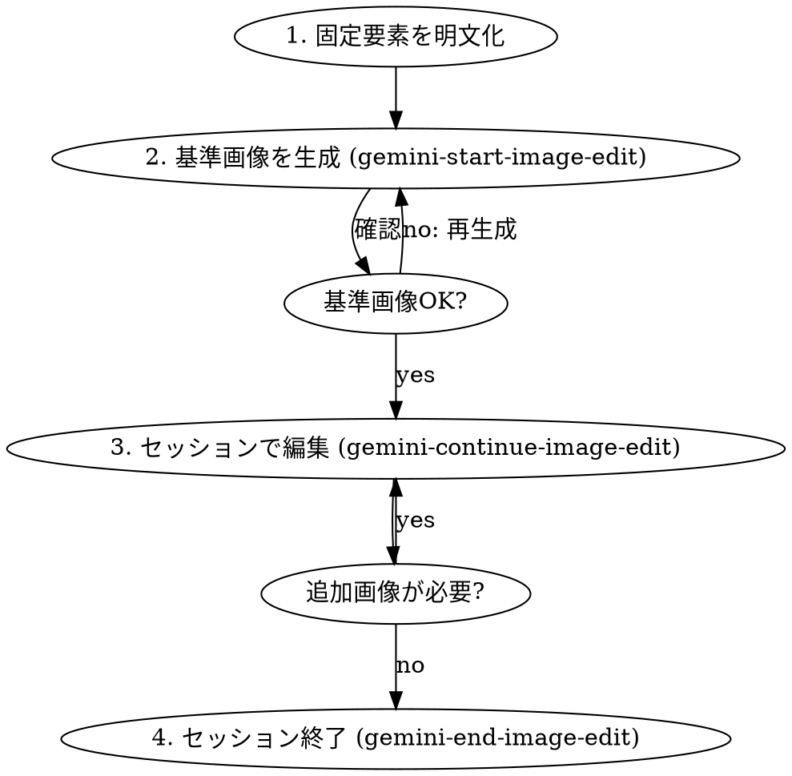

# Gemini Consistent Images - 一貫性のある画像シリーズ生成

## Overview

Gemini MCPで複数画像を生成する際、被写体のデザインやテイストの一貫性を保つためのワークフロー。

**核心原則:** 「固定要素を明文化し、セッション機能で維持する」

## When to Use

- 操作説明画像（同じ端末で画面だけ変えたい）
- 製品写真シリーズ（同じ製品を異なる角度・シーンで）
- キャラクターイラスト（同じキャラを異なるポーズ・場面で）
- チュートリアル画像（一貫したUI/デザインで手順を示す）

## The Process



### Step 1: 固定要素の明文化

最初に「変わってはいけない要素」を文章で定義する。

**端末の場合:**
```
【固定要素】
- 形状: 角R中程度、厚み薄め、側面フラット
- 画面: 比率20:9、ベゼル均一で極細
- カメラ: 背面右上の長方形アイランド、レンズ2つ縦配置、フラッシュ1つ
- 素材: マットなアルミ
- 色: ミッドナイトブラック
- 撮影: 白背景、45度ソフトライト、影薄め
```

**キャラクターの場合:**
```
【固定要素】
- 髪: ショートボブ、黒髪、前髪は眉上
- 顔: 丸顔、大きな目、小さな鼻
- 服: 白シャツ、紺のカーディガン
- スタイル: アニメ調、線は細め、パステルカラー
```

### Step 2: 基準画像の生成

`gemini-start-image-edit` で最初の画像を生成。

**プロンプト構成:**
```
被写体: [何を描くか]
固定要素: [Step1で定義した内容をそのまま貼る]
撮影/スタイル: [構図、光、背景]
禁止: [固定要素]の変更
```

**実行例:**
```
gemini-start-image-edit
- prompt: "スマートフォンの製品写真。
  固定要素: 角R中程度、厚み薄め、側面フラット、画面比率20:9、ベゼル均一で極細。
  カメラ: 背面右上の長方形アイランド、レンズ2つ縦配置、フラッシュ1つ。
  素材: マットなアルミ、色はミッドナイトブラック。
  撮影: 白背景、45度ソフトライト、影薄め、正面やや斜め上から。
  画面: ホーム画面を表示。
  禁止: 端末形状・カメラ配置・色・素材の変更。"
- aspectRatio: "9:16"
- imageSize: "2K"
```

**確認ポイント:**
- 固定要素が意図通りか
- この画像を基準として続けられるか

### Step 3: セッション内で編集

`gemini-continue-image-edit` で可変要素のみ変更。

**重要:** 毎回「固定要素は変更しない」を明記

**プロンプト構成:**
```
端末の外観（形状、色、カメラ配置、角度、光、影）は一切変更しない。
変更は[可変要素]のみ: [具体的な変更内容]
固定要素: [再掲または「前回と同じ」]
```

**実行例:**
```
gemini-continue-image-edit
- sessionId: "edit-XXXXX-XXXXX"
- prompt: "端末の外観（形状、色、カメラ配置、角度、光、影）は一切変更しない。
  変更は画面内容のみ: 「設定」アプリを開いた状態。Wi-Fi、Bluetooth、機内モードなどの設定項目が並んでいる。
  固定要素は前回と完全に同一を維持。"
```

### Step 4: セッション終了

すべての画像が完成したら `gemini-end-image-edit` でセッションを閉じる。

## Quick Reference

| 操作 | ツール | 用途 |
|------|--------|------|
| 基準画像作成 | `gemini-start-image-edit` | セッション開始＋初回生成 |
| バリエーション作成 | `gemini-continue-image-edit` | 可変要素のみ変更 |
| 終了 | `gemini-end-image-edit` | セッションを閉じる |
| セッション一覧 | `gemini-list-image-sessions` | 既存セッションの確認 |

## Common Mistakes

| ミス | 対策 |
|------|------|
| 毎回 `gemini-generate-image` を使う | セッション機能なしでは一貫性を保てない。`start-image-edit` を使う |
| 固定要素を省略する | 毎回明記する。「前回と同じ」でも書く |
| 可変要素と固定要素を混ぜて指示 | 先に固定要素を書き、その後に可変要素を書く |
| セッションを終了せずに放置 | `gemini-list-image-sessions` で確認し、不要なものは終了 |

## Tips

- **アスペクト比は最初に固定**: すべての画像で同じ比率を使う
- **背景・光は固定要素に含める**: テイストの統一に大きく影響
- **日本語プロンプトOK**: Geminiは日本語を公式サポート
- **差分チェック**: 生成後は基準画像と並べて確認
- **参照画像は少数精鋭**: 入力枚数が多いと影響が分散する（3枚程度が目安）

## Prompt Templates

### 端末操作説明シリーズ
```
【基準画像】
スマートフォンの製品写真。
固定要素: [端末の詳細仕様]
撮影: [構図・光・背景]
画面: ホーム画面
禁止: 端末外観の変更

【バリエーション】
端末外観は一切変更しない。
変更は画面のみ: [画面内容]
固定要素は完全維持。
```

### キャラクターシリーズ
```
【基準画像】
キャラクターイラスト。
固定要素: [外見・服装・スタイル]
ポーズ: 正面立ち
背景: 白
禁止: キャラクターの外見変更

【バリエーション】
キャラクターの外見は一切変更しない。
変更はポーズ/背景のみ: [変更内容]
固定要素は完全維持。
```
