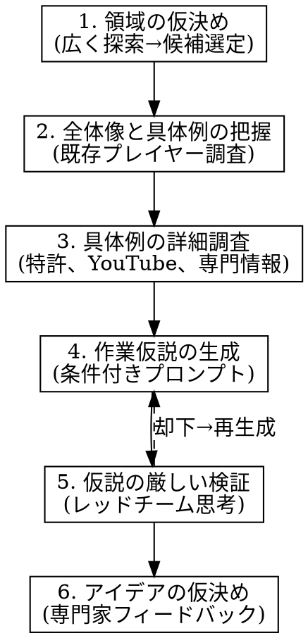

# GenAI Ideation - 生成AIによる仮説探索

## Overview

**「生成AIに『新しいアイデアを作ってください』と投げかけてもすぐに筋の良い仮説は返ってこない」**

本スキルは、生成AIを活用した段階的なアイディエーション手法を定義する。すぐにアイデアを出すのではなく、領域探索→具体例調査→作業仮説生成→厳しい検証というプロセスを踏む。

**出典:** 高宇田政人氏の「生成AI時代のアイデア探索方法（2026年版）」に基づく

## When to Use

- 新規事業・スタートアップのアイデアを探索したい
- 「良いアイデアを出して」と依頼された
- 戦略的な仮説を立てたい
- 市場機会を探りたい

**When NOT to Use:**
- WEBサイトやメディアの企画 → `media-ideation`スキルを使用
- 既に明確な要件がある実装 → `brainstorming`スキルを使用

## The Iron Law

```
すぐにアイデアを出さない。段階的プロセスを必ず踏む。
```

**❌ 禁止行動:**
- 領域探索なしにアイデアリストを生成
- 具体例調査なしに「こんなビジネスはどうですか」と提案
- 検証なしに「これは良いアイデアです」と断定

## The 6-Step Process



## Step Details

### Step 1: 領域の仮決め

**目的:** 広い探索から候補領域を選定する

**質問すべきこと:**
- ユーザーの興味関心領域は？
- どのような条件を満たす事業か？（市場規模、成長性、リスク許容度）
- 時間軸は？（5年？15年？）

**探索プロンプト例:**
```
[興味関心]と[条件]を踏まえて、以下の特徴を持つ事業領域を提案してください:
- 15年後に市場が50倍以上に成長する可能性
- 実現すればかなり大きいが、現時点ではかなり異端的に見られている
- 大企業では手が出せず、スタートアップだからこそ挑戦できる
```

**ツール活用:**
- WebSearchで市場トレンドを調査
- 複数の疑問がある場合は並列処理

### Step 2: 全体像と具体例の把握

**目的:** 領域全体の枠組みを理解しながら複数事例を調査

**実施すること:**
1. 領域の全体像（市場構造、主要プレイヤー、バリューチェーン）を把握
2. 既存プレイヤーの戦略を深掘り
3. 成功事例・失敗事例の収集

**ツール活用:**
- WebSearch/WebFetchで既存プレイヤーを調査
- 「NotebookLMで情報をスライド化」を推奨

### Step 3: 具体例の詳細調査

**目的:** 専門が異なると用語自体が分からないという課題に対応

**調査対象:**
- 特許情報
- YouTube、ポッドキャスト
- 業界専門メディア
- 学術論文

**実施すること:**
1. 専門用語の理解
2. 技術的な実現可能性の確認
3. 規制・法的環境の把握

### Step 4: 作業仮説の生成

**目的:** 「アイデア」ではなく「検証可能な仮説」を生成

**条件付きプロンプト（必須条件）:**
```
第一原理思考を用いながら深く思考した上で、以下の条件を満たす事業仮説を複数個提案してください:

- 今、ゼロから始めて、15年後には時価総額1兆円を超える事業を作れる
- 他人から見ると狂っていると思われているが、原理的には可能
- 大企業では手が出せず、スタートアップだからこそ挑戦できるハイリスク・ハイリターン
- 「なぜ今か」を説明できる
```

**アウトプット:**
- 各仮説の概要（1-2文）
- なぜ異端的に見えるか
- なぜ原理的に可能か
- なぜ今か

### Step 5: 仮説の厳しい検証

**目的:** 生成AIは「仮説検証が苦手」という限界を認識し、レッドチーム思考で厳しく批判

**重要:** 生成AIはユーザーに寄り添う傾向があるため、明確に批判役割を与える

**検証プロンプト:**
```
あなたは複数の専門家（技術者、投資家、業界経験者、規制当局）の観点を持つレッドチームです。
以下の仮説を厳しく批判・検証してください:

[仮説]

検証観点:
1. 技術的実現可能性の穴
2. 市場性・需要の疑問点
3. 競合優位性の脆弱性
4. 規制・法的リスク
5. チーム・実行力の要件
6. 「なぜ今か」の反論
```

**検証後の判断:**
- 致命的な問題 → Step 4に戻り再生成
- 改善可能な問題 → 対策を検討
- 軽微な懸念 → Step 6へ

### Step 6: アイデアの仮決め

**目的:** 筋の良い仮説を持って専門家にフィードバックを求める準備

**アウトプット:**
1. 最終候補の仮説（1-3個）
2. 各仮説の強み・弱み
3. 検証で残った懸念点
4. 次に確認すべきこと（Webに載っていない現場情報）

**推奨アクション:**
- 投資家や専門家との相談
- 実際に人に会って現場情報を収集
- MVP（最小限のプロダクト）での検証

## Common Mistakes

| 間違い | 正しい対応 |
|--------|-----------|
| すぐにアイデアリストを生成 | 領域探索から始める |
| 「良いアイデア」と肯定的に評価 | レッドチーム思考で厳しく批判 |
| Web検索のみで完結 | 現場情報の重要性を伝える |
| 一度の生成で決定 | 100回程度のプロンプト往復を推奨 |

## Red Flags - プロセス違反の兆候

以下の行動をしていたら、プロセスを確認:

- 「ではアイデアを10個出しますね」→ 領域探索を先にする
- 「これは素晴らしいアイデアです」→ レッドチーム検証を実施する
- 「完璧なアイデアが見つかりました」→ 懸念点と次の検証ステップを必ず提示

## Tools Recommendation

| ツール | 用途 |
|--------|------|
| ChatGPT Pro | 調査の最優先選択肢（Deep Research） |
| NotebookLM | 情報のスライド化、ポッドキャスト化 |
| Google Sheets AI関数 | 複数の疑問を一括処理 |
| WebSearch/WebFetch | 市場調査、競合分析 |

## Output Format

### 探索過程の記録

```markdown
# [プロジェクト名] アイデア探索記録

## 1. 探索条件
- 興味関心領域:
- 目標条件（市場規模、時間軸など）:
- 制約条件:

## 2. 候補領域
| 領域 | 市場規模予測 | 異端度 | 選定理由 |
|------|-------------|--------|---------|

## 3. 調査した具体例
- 既存プレイヤー:
- 特許・技術情報:
- 成功・失敗事例:

## 4. 作業仮説
### 仮説1: [名称]
- 概要:
- なぜ異端的か:
- なぜ原理的に可能か:
- なぜ今か:

## 5. 検証結果
### 仮説1の検証
- 技術的実現可能性:
- 市場性:
- 競合優位性:
- 規制リスク:
- 総合判断:

## 6. 最終候補
- 推奨仮説:
- 残る懸念:
- 次の検証ステップ:
```

## References

- 高宇田政人「生成AI時代のアイデア探索方法（2026年版）」
  https://blog.takaumada.com/entry/genai-ideation-2026
